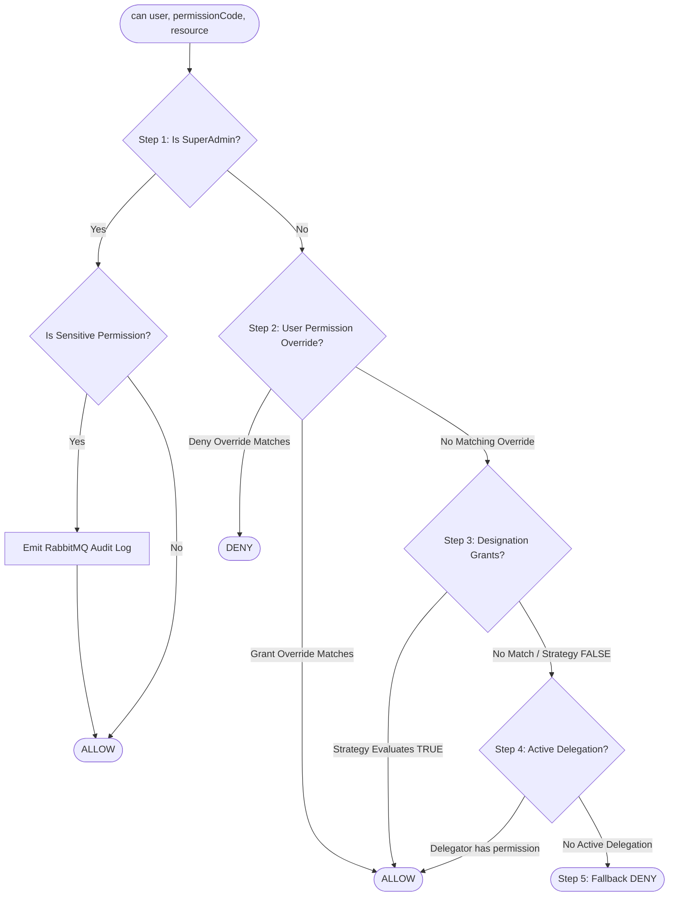

# Centralized Scoped Permissions Architecture Specification

> **MASTER AUTHORIZATION SPECIFICATION**
> This document defines the architectural standard for authorization across the entire Softvence monorepo. Every developer and AI coding agent must follow this specification for any feature involving permissions, access control, user roles, or entity gating.

---

## 1. Core Architectural Concept

The Softvence platform uses a **Centralized Scoped Permission Engine** rather than naive role-based access control (RBAC). 

In our system:
1. **Roles and Designations do not possess direct hardcoded privileges in application code.**
2. A **Designation** is assigned a set of **Permissions** paired with a **Scope Resolution Strategy**.
3. Individual users can receive **Explicit Overrides** (with Deny overriding any grant) or **Delegations** from other users for designated time windows.
4. All authorization decisions across the entire platform resolve strictly through a single deterministic function: `can(user, permissionCode, resourceContext)`.

---

## 2. Multi-Tier Permission Resolution Pipeline

When `can(user, permissionCode, resourceContext)` is invoked, the [AuthorizationEngine](./apps/api/src/core/authorization/AuthorizationEngine.ts) executes the following 5-step resolution pipeline in exact order:



### Step 1: SuperAdmin Fast-Path & Audit Trail
- If `user.systemRole === 'SuperAdmin'`, the check returns `true` immediately without evaluating database grants.
- **Rule BE-6 / PERM-1**: If the permission is classified as sensitive (e.g. `billing.*`, `*.manage`, `*.delete`, `*.revoke`, `*.reassign`, `auth.user.create`, `organization.*`), an asynchronous audit log is published to RabbitMQ -> MongoDB via `AuditLogService.log()`. Read evaluations remain high-throughput and noise-free.

### Step 2: Explicit User Overrides (`user_permission_overrides`)
- Super admins can assign explicit overrides to an individual user, either globally or scoped to a specific `departmentId`, `teamId`, or `projectId`.
- **Deny Priority**: An override with `isDeny = true` **immediately short-circuits to false**, regardless of how senior the user's designation is.
- An override with `isDeny = false` allows the action if the resource context matches.
- Overrides honor optional expiration timestamps (`expiresAt`).

### Step 3: Designation Grants & Scope Evaluation (`ScopeEvaluator`)
- The engine fetches active designation permissions for the user's `designationId`.
- For matching permission codes, it passes the user, grant, and resource context to [ScopeEvaluator.evaluate()](./apps/api/src/core/authorization/ScopeEvaluator.ts).

### Step 4: Active Delegations (`delegations`)
- If the direct check fails, the engine queries active delegations where `delegateeId === user.id` and current time is within `validFrom`–`validUntil`.
- If the delegation scope covers the permission code (`*`, wildcard prefix, or exact match), the engine re-evaluates permissions acting as the delegator, scoped down.
- Delegations **only expand access, never restrict it**, and never grant more than the delegator holds.

### Step 5: Fallback Deny
- If none of the above steps yield an explicit grant, access is denied (`false`).

---

## 3. Scope Resolution Strategies

The [ScopeEvaluator](./apps/api/src/core/authorization/ScopeEvaluator.ts) interprets the enum `ScopeResolutionStrategy` against the provided `AuthorizationResourceContext`:

| Strategy | Required Resource Context | Evaluation Rule |
| :--- | :--- | :--- |
| `Global` | None | Returns `true` for all resources across the entire organization. |
| `OwnDepartment` | `{ departmentId }` | Returns `true` if `resource.departmentId` matches the user's designation department, any descendant department in the hierarchy tree, or any department of a team the user actively belongs to. |
| `OwnTeam` | `{ teamId }` or `{ projectId }` | Returns `true` if the user is an active member of `resource.teamId` (`leftAt: null`) or if the user's active team is assigned to `resource.projectId` via `projectTeamAssignments`. |
| `OwnProject` | `{ projectId }` | Returns `true` if the user is directly assigned to the project (`projectAssignments`) or assigned to a component within the project (`componentAssignments`). |
| `OwnProfile` | `{ profileId }` | Returns `true` if the user is linked to the seller/freelancer profile via `profileSellers`. |
| `ExplicitDepartments` | `{ departmentId }` | Returns `true` if `resource.departmentId` is explicitly listed in `designation_permission_scope_targets`. |
| `ExplicitTeams` | `{ teamId }` | Returns `true` if `resource.teamId` is explicitly listed in `designation_permission_scope_targets`. |
| `ExplicitProjects` | `{ projectId }` | Returns `true` if `resource.projectId` is explicitly listed in `designation_permission_scope_targets`. |

---

## 4. Manifest-Driven Permissions Registry

Permissions are strictly **code artifacts** declared in module manifests.

```ts
// src/Modules/Projects/projects.manifest.ts
import type { PermissionManifestItem } from "@/core/permissions/permission.types";
import { SCOPE_PRESETS } from "@/core/permissions/scopePresets";

export const projectsPermissions: PermissionManifestItem[] = [
  {
    code: "project.view",
    module: "Projects",
    description: "View project details",
    supportedScopes: SCOPE_PRESETS.PROJECT_HIERARCHICAL,
  },
  {
    code: "project.manage",
    module: "Projects",
    description: "Manage project settings, assignments, and budgets",
    supportedScopes: SCOPE_PRESETS.PROJECT_HIERARCHICAL,
  },
  {
    code: "project.delete",
    module: "Projects",
    description: "Soft-delete a project",
    supportedScopes: SCOPE_PRESETS.PROJECT_HIERARCHICAL,
  },
];
```

### Registry Rules
1. **Never manual SQL insert**: Permissions are synced from manifests via the registry sync runner.
2. **Never hard delete**: Deprecated permissions have `isActive: false` and `deprecatedAt: new Date()`.
3. **No runtime code changes for grants**: Super admins manage `designation_permissions` and `user_permission_overrides` via UI at runtime.

---

## 5. Redis Caching & Global Version Invalidation

To achieve sub-millisecond authorization without database bottlenecks, permissions are cached in Redis with a global version counter:

```text
Redis Key Scheme:
- Global Counter:           permission_version               -> integer (e.g. 42)
- Permission Definition:    permission:code:{code}:v{version} -> { id, code, isActive }
- Designation Grants:       permission:designation:{id}:v{version} -> ResolvedDesignationGrant[]
- User Permission Map:      permission:user:{id}:v{version}  -> UserPermissionMap
- Active Catalogue:         permission:catalogue:active:v{version} -> PermissionCatalogueItem[]
```

### Invalidation Invariant (Rule BE-10)
Whenever any write occurs to:
- `designation_permissions`
- `designation_permission_scope_targets`
- `user_permission_overrides`
- `delegations`
- `permissions` (sync or deprecation)

The service **MUST** call:
```ts
await AuthorizationEngine.getInstance().invalidateCache();
```
This increments `permission_version`, instantly causing all stale cached grants and user maps to invalidate across all app instances without requiring Redis key scanning.

---

## 6. Backend API Contracts & Capability Annotations

### 1. Route Protection Middleware (`requirePermission`)
```ts
// apps/api/src/Modules/Projects/projects.controller.ts
import { requirePermission } from "@/middleware/requirePermission";

// Coarse / Creation endpoint
router.post(
  "/",
  requirePermission("project.create"),
  projectController.create
);

// Scoped / Resource endpoint with ResourceLoader
router.patch(
  "/:id/reassign",
  requirePermission("project.reassign", async (req) => {
    const project = await prisma.project.findUnique({
      where: { id: req.params.id },
      select: { departmentId: true, teamId: true, id: true },
    });
    return project ? { departmentId: project.departmentId, teamId: project.teamId, projectId: project.id } : undefined;
  }),
  projectController.reassign
);
```

### 2. Generic 403 Response & Denial Audit (Rule BE-18)
When authorization fails:
- The API responds with `403 Forbidden` and a generic message: `"You don't have access to this resource"`.
- Detailed internal reason (missing scope, failed team comparison) is recorded in server-side logs and RabbitMQ audit logs only.

### 3. Server-Resolved Capabilities (`_capabilities`) (Rule BE-17)
Every list and detail endpoint must include a pre-computed `_capabilities` object:

```ts
// apps/api/src/Modules/Projects/projects.service.ts
const projectContext = {
  departmentId: project.departmentId,
  teamId: project.teamId,
  projectId: project.id,
};

return {
  ...project,
  _capabilities: {
    canEdit: await can(user, "project.edit", projectContext),
    canReassign: await can(user, "project.reassign", projectContext),
    canDelete: await can(user, "project.delete", projectContext),
  },
};
```

---

## 7. Frontend Integration Standard

### 1. The Two Gating Primitives (Rule FE-1)
The frontend allows **only two gating mechanisms**:

#### Primitive A: Permission Map (`hasPermission` / `<PermissionGate>`)
For top-level navigation, entire routes, or actions not tied to a single record:
```tsx
import { PermissionGate } from "@/components/permission-gate/PermissionGate";

<PermissionGate code="project.create">
  <Button onClick={openCreateModal}>Create Project</Button>
</PermissionGate>
```

#### Primitive B: Capability Annotations (`record._capabilities.canX`)
For table row actions, detail buttons, or record mutations:
```tsx
// ✅ CORRECT: Record-specific capability
{project._capabilities?.canReassign && (
  <Button variant="outline" onClick={() => handleReassign(project.id)}>
    Reassign Team
  </Button>
)}

// ❌ FORBIDDEN: Never compare IDs client-side
{project.teamId === user.teamId && <Button>Reassign</Button>}
```

### 2. 403 Handling & Passive Permission Refresh (Rule FE-6 / FE-9)
- When any API call receives a `403`, `/lib/api.ts` emits an `onForbidden()` event.
- The `AuthProvider` / `PermissionContext` passively refetches the user's fresh permission map in the background without forcing a page reload or logout.
